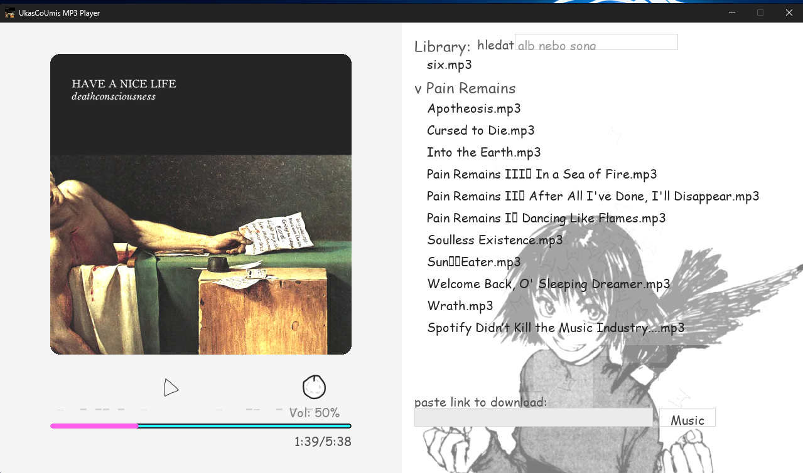
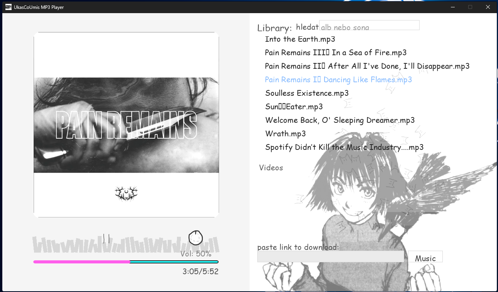

# UkasCoUmis

Chaotic little **Pygame music player** with album art, a simple visualizer and a dumb cat moshpit in the background.

- left: album cover + visualizer + controls
- right: library (music + "videos audio")
- bottom-right: paste a YouTube link -> download/extract MP3

It's a hobby project. It works, but it's not polished - that's kind of the point.

## Features

- Play local audio from `./library/`
- Download/extract audio from YouTube using `yt-dlp`
- Search/filter the library
- Seek by clicking the progress bar
- Volume knob
- Reads metadata + tries to fetch album art
- Reactive visuals + cat moshpit

## Project structure

```
.
|- main.py              # app entrypoint
|- library.py           # library indexing/render items
|- library/             # your music (mp3)
|- videos/              # optional: audio extracted from videos
|- *.png                # UI images
`- requirements.txt
```

## Requirements

- Python 3.11+ recommended
- Windows tested (should also run on Linux/macOS if dependencies are available)

Python deps are listed in `requirements.txt`.

### Notes on optional deps

The app will run with **just** `pygame`, but some features need extra packages:

- `mutagen`: track length + tag reading
- `requests`: album art fetching
- `yt-dlp`: YouTube downloads
- `numpy` + `soundfile` / `pydub`: better audio-energy visualization (PCM-based)
    - `pydub` typically requires **ffmpeg** installed and available on PATH

## Installation

Create a venv and install dependencies:

```powershell
python -m venv .venv
.\.venv\Scripts\Activate.ps1
python -m pip install -r requirements.txt
```

## Run

```powershell
python main.py
```

## Build

### Windows EXE

There’s a build workspace folder so we don’t spam the repo root with build junk:

```powershell
cd D:\PythonShit\UkasCoUmis
.\.venv\Scripts\Activate.ps1
\# outputs go to build_workspace\out\...
powershell -ExecutionPolicy Bypass -File .\build_workspace\windows\build_windows.ps1
```

Output:
- `build_workspace\out\dist\...`

### Notes (yt-dlp / ffmpeg)

The in-app YouTube download/extract feature uses `yt-dlp` and (usually) **ffmpeg**.

- `yt-dlp` is installed as a Python dependency via `requirements.txt`
- `ffmpeg` is expected to be available on PATH (or shipped alongside the exe in your release zip)

If users report that downloads fail, include `ffmpeg.exe` and `ffprobe.exe` next to the exe in your release archive.

### Android APK (reproducible debug build)

Use Linux/WSL for Android builds.

#### Toolchain (known-good versions)

- OS: Ubuntu 22.04+ / WSL2 Ubuntu
- Python: 3.11.x
- Buildozer: 1.5.0
- Cython: 0.29.37
- Java: OpenJDK 17
- Android API/SDK: 33
- Android NDK: 25b

#### Fresh environment setup

```bash
sudo apt update
sudo apt install -y git zip unzip openjdk-17-jdk python3 python3-venv python3-pip

cd /home/runner/work/MusicPlayer/MusicPlayer
python3 -m venv .venv
. .venv/bin/activate
python -m pip install --upgrade pip
python -m pip install buildozer==1.5.0 cython==0.29.37

./tools/build_android.sh
```

Build output (debug APK artifact):

- `build_workspace/out/android/*-debug*.apk`

## Usage

- Click a song in the right-side library to play it.
- Space: play/pause
- Left/Right arrows: seek -5s/+5s
- Click the progress bar to jump
- Drag the volume knob to change volume
- Paste a YouTube link in the download box (bottom-right) and press Enter.

## Screenshots

### Home (idle)



### Playing (visuals + cats)



## Contributing

If you want to help out, pick anything from this list:

- **Android APK build** (Buildozer recipe, packaging assets, ffmpeg situation)
- bugfixes / UI cleanup / performance (library scanning can get heavy)
- issues tagged “good first issue” (if/when we add them)

PRs are welcome. Keep it simple and try not to reformat the whole file unless you have to.

## How to get more people to see the project

Stuff that actually helps on GitHub:

- Add a short description + topics in the repo settings (e.g. `pygame`, `music-player`, `yt-dlp`, `visualizer`).
- Cut a Release with a zip (EXE + assets + ffmpeg binaries if needed).
- Keep the two screenshots above up to date (people click when they see UI).
- Post a 10–20s clip/gif (cats going crazy while playing) in the README.
- Share it in places where it fits: r/Python, r/pygame, relevant Discord servers, and show it to classmates.

## Troubleshooting

### `pydub` errors / no decoding

Install ffmpeg:
- Windows: `winget install Gyan.FFmpeg`
- Or download from https://ffmpeg.org/ and add to PATH

### `soundfile` install fails

On Windows it usually works via wheels. If not, try upgrading pip:

```powershell
python -m pip install --upgrade pip
```

### Buildozer: `Could not find acceptable C compiler`

Install missing build tools:

```bash
sudo apt install -y build-essential
```

### Buildozer: `sdkmanager`/license errors

Make sure Java 17 is active and rebuild:

```bash
java -version
./tools/build_android.sh
```

(`buildozer.spec` sets `android.accept_sdk_license = True`.)

### APK file not found after successful logs

The project writes APKs to:

- `build_workspace/out/android/`

If missing, clean and rebuild:

```bash
rm -rf .buildozer build_workspace/out/android
./tools/build_android.sh
```

## License

No license file yet.

